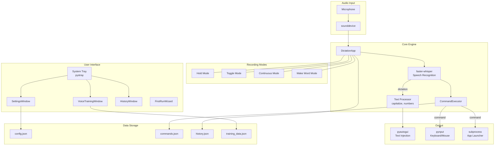

# Samsara Architecture

A quick overview of how Samsara works under the hood.

## System Diagram



## Component Overview

| Component | File | Purpose |
|-----------|------|---------|
| **DictationApp** | `dictation.py` | Main orchestrator - manages recording, hotkeys, tray icon, and coordinates all other components |
| **CommandExecutor** | `dictation.py` | Parses transcribed text, matches voice commands, executes actions (hotkeys, launches, mouse clicks) |
| **SettingsWindow** | `dictation.py` | CustomTkinter UI for all configuration - hotkeys, sounds, commands, model selection |
| **VoiceTrainingWindow** | `voice_training.py` | Microphone calibration, custom vocabulary, word corrections, initial prompts |
| **HistoryWindow** | `dictation.py` | View/copy/clear past dictations and commands |
| **FirstRunWizard** | `dictation.py` | Initial setup - mic selection, hotkey config, model choice |
| **SplashScreen** | `dictation.py` | Loading screen shown during startup |

## Data Flow

### Speech Recognition Pipeline

```
1. User speaks
      │
      ▼
2. sounddevice captures audio (16kHz, mono, float32)
      │
      ▼
3. Audio buffered as numpy array
      │
      ▼
4. faster-whisper transcribes with VAD filter
      │
      ▼
5. VoiceTrainingWindow.apply_corrections() fixes known errors
      │
      ▼
6. CommandExecutor.process_text() checks for commands
      │
      ├──► Command found → Execute (hotkey/launch/mouse/etc)
      │
      └──► No command → process_transcription() → Paste text
```

### Recording Modes

| Mode | Trigger | Behavior |
|------|---------|----------|
| **Hold** | Hold hotkey | Records while held, transcribes on release |
| **Toggle** | Press hotkey | Press to start, press again to stop |
| **Continuous** | Ctrl+Alt+D | Always listening, auto-transcribes on silence |
| **Wake Word** | Ctrl+Alt+W | Waits for trigger phrase, then executes command |

## Key Dependencies

| Library | Purpose |
|---------|---------|
| `faster-whisper` | OpenAI Whisper implementation (GPU-accelerated) |
| `sounddevice` | Cross-platform audio recording |
| `pynput` | Global hotkey detection, keyboard/mouse control |
| `pyautogui` | Text injection via clipboard paste |
| `pystray` | System tray icon and menu |
| `customtkinter` | Modern dark-themed UI widgets |
| `numpy` | Audio buffer handling |

## File Structure

```
Samsara/
├── dictation.py        # Main app + all UI classes
├── voice_training.py   # Voice training module
├── commands.json       # Voice command definitions
├── config.json         # User settings (created on first run)
├── history.json        # Dictation history (auto-created)
├── sounds/             # WAV files for audio feedback
├── Docs/               # User documentation
└── _launcher.vbs       # Silent Windows launcher
```

## Adding New Features

**New voice command type:**
1. Add handler in `CommandExecutor.execute_command()`
2. Add UI fields in `SettingsWindow.open_command_editor()`
3. Add save logic in the editor's `save_command()` function

**New setting:**
1. Add default in `DictationApp.load_config()`
2. Add UI control in `SettingsWindow.__init__()`
3. Save in `SettingsWindow.save_settings()`

**New recording mode:**
1. Add mode handling in `on_key_press()` / `on_key_release()`
2. Create `start_X_mode()` and `stop_X_mode()` methods
3. Add audio callback for the mode
