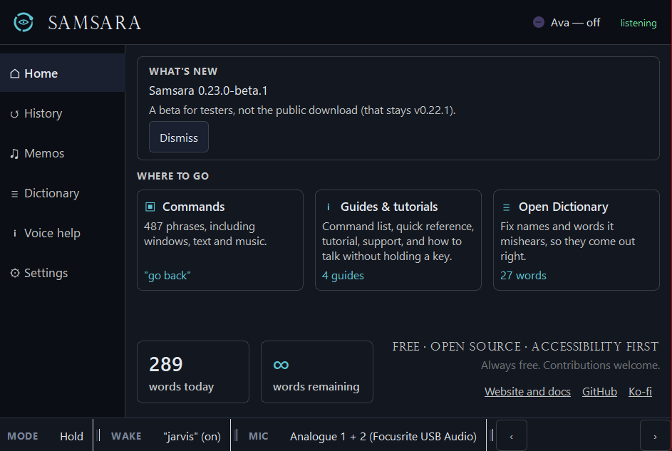

# Samsara

**Use your Windows computer by voice.**

Dictate a message, move between windows, scroll a page, or click a numbered
control. Samsara is built for people who need to do more with their voice
and less with a keyboard or mouse.

**Free · Open source · Accessibility first**

No word limits, subscriptions, or paid feature tiers. Optional third-party
services may have their own charges.

**[Download for Windows](https://github.com/Morne-Ingstar/Samsara/releases/latest)**
· [Try the beta](https://github.com/Morne-Ingstar/Samsara/releases/tag/v0.23.0-beta.1)
· [Website](https://morneis.com/samsara)

*Beta/development interface. The current public release has an earlier
interface; see the release choices below.*

## Get started

You need **Windows 10 or 11 and a microphone**. The packaged app includes
Python; you do not need to install it. A CPU is enough to get started.
Compatible NVIDIA GPUs can use the optional [CUDA add-on](Docs/CUDA.md).

1. Open the [Windows download page](https://github.com/Morne-Ingstar/Samsara/releases/latest).
   Choose the **installer** for a normal Windows install with a Start-menu
   shortcut and uninstall entry, or the **ZIP** for a portable extracted folder;
   do not download GitHub's source-code archives.
2. Run the installer, or extract the ZIP and run **Samsara.exe** from the
   extracted folder.
3. Follow the setup wizard to select your microphone and download a
   transcription model. An internet connection is needed for those downloads.
4. Try a sentence in a blank note. The default hold-to-dictate shortcut is
   **Ctrl+Shift**: hold, speak, release. If holding a key is uncomfortable,
   configure **Hands Free** or wake-word listening in Settings.

Hotkeys and listening behavior are configurable. The in-app Quick Reference
shows your bindings. [Open the full quick start →](Docs/QUICKSTART.md)

In a Hands Free Dictate session, say **“finish”** to commit the staged text.
After saying **“show numbers,”** name a target: **“click 7,” “right click 7,”**
or **“double click 7.”**

### Which version should I use?

| Download | Who it is for |
| --- | --- |
| [**v0.22.1 — public release**](https://github.com/Morne-Ingstar/Samsara/releases/tag/v0.22.1) | Start here for everyday use. |
| [**v0.23.0-beta.1 — tester build**](https://github.com/Morne-Ingstar/Samsara/releases/tag/v0.23.0-beta.1) | Try newer hands-free and command workflows and report rough edges. |

Samsara is still evolving; “public release” does not mean every workflow is
finished. The screenshot above comes from beta/development work, and features
can differ between downloads. Read the [release notes](CHANGELOG.md) for the
version you choose.

## What you can do

| Your task | How Samsara helps |
| --- | --- |
| **Write without typing** | Dictate into the focused text box. Use hold-to-dictate for short messages or Hands Free for longer thoughts. |
| **Navigate without precise mouse work** | Say **“show numbers”** to label available controls, then use the numbered targets. |
| **Control windows and pages** | Use commands such as **“scroll down”** and **“new tab”**, plus window-management commands. |
| **Control media** | Say **“volume up”** or use playback commands while you work. |
| **Improve recognition** | Add names and recurring corrections in the Dictionary; review previous dictations in History. |
| **Talk to Ava** | Use the optional assistant with a local Ollama model and spoken replies, or configure a cloud provider with your own API key. |

Spoken commands need an active command-capable listening mode. For wake-word
commands, enable wake words and use your configured phrase—**“Jarvis”** by
default—before the command. Availability also depends on enabled command
packs and the app you are controlling. Use the in-app command reference to
explore your setup.

Optional integrations cover reminders, health logs, music, smart-home
devices, and more. They are not required for dictation.
[Explore the command reference →](Docs/VOICE_COMMANDS.md)

## Privacy and practical limits

**Core transcription runs on your computer.** You can dictate without a cloud
AI account. Local Ava needs Ollama and a downloaded model; Windows speech
voices can read replies locally.

Online features are separate choices: cloud AI and web search, Edge text-to-speech,
configured Smart Actions endpoints, and network-backed integrations send the
information needed for those features. Downloading models and checking for
updates also use the internet. Automatic update checks are off by default.

History and logs can contain your words. Beta/development builds also have a
local intent-observation log enabled by default; it records dictated text and
the focused app's process name. See [privacy, local storage, and how to disable
that log](PRIVACY.md).

A few things to expect:

- Speed and recognition depend on your hardware, selected model, microphone,
  and surroundings. A GPU can help; there is no universal latency guarantee.
- Voice navigation depends on what the target app exposes. Some controls need
  a different approach; Chromium browser support has an
  [optional extension](browser_extension/README.md).
- Command coverage and confirmation behavior vary by action and setup.
  Universal command undo is not available.
- Streaming and experimental echo reduction have limitations. Start with
  ordinary dictation, then enable additional features as you need them.

## From the developer

> I'm Morne, and my hands fucking hurt.
>
> I've had HSD for a decade—using a mouse and keyboard hurts, all the time.
> So I use these inflamed joints to build things that ease the load on
> someone else's. For the past year, that's been Samsara: an ongoing
> exploration of how accessible AI can actually make a computer, built by
> someone who needs the answer personally.
>
> It works for me every day, and it's still early—expect rough edges.
> Whether your hands hurt or not, I sincerely hope it helps you. And if it
> does, I'd love to hear from you.
>
> — Morne

[More about the project and its direction →](https://morneis.com/samsara)

## Documentation and contributing

- **Using Samsara:** [Quick start](Docs/QUICKSTART.md) ·
  [Voice commands](Docs/VOICE_COMMANDS.md) ·
  [Hands-free modes](Docs/HANDS_FREE_MODES.md) ·
  [NVIDIA acceleration](Docs/CUDA.md)
- **Understanding your data:** [Privacy and local storage](PRIVACY.md)
- **Building and extending:** [Run from source](Docs/QUICKSTART.md#from-source) ·
  [Custom commands and plugins](Docs/CUSTOM_COMMANDS.md) ·
  [Architecture](Docs/ARCHITECTURE.md)
- **Following development:** [Release history](CHANGELOG.md) ·
  [Issues](https://github.com/Morne-Ingstar/Samsara/issues)

You do not need to code to help. Tell us what you tried to do by voice, what
happened, and where you still had to reach for the keyboard or mouse.
[Report a bug or share beta feedback](https://github.com/Morne-Ingstar/Samsara/issues/new/choose).
You do not need to disclose a diagnosis or disability.

Code contributions are welcome too. Describe the problem and include focused
verification for the change. Read [AGENTS.md](AGENTS.md) before using a coding
agent in this repository.

## Support and license

Samsara is free, with no paid feature tiers. If it helps you,
[GitHub sponsorship](https://github.com/sponsors/Morne-Ingstar) or
[Ko-fi](https://ko-fi.com/morneingstar) helps fund development.
Contributions are optional.

Licensed under [AGPL-3.0](LICENSE). Bundled third-party components retain
their own licenses; see [third-party notices](THIRD_PARTY_NOTICES.md).

Built with [Whisper](https://github.com/openai/whisper),
[faster-whisper](https://github.com/SYSTRAN/faster-whisper),
[OpenWakeWord](https://github.com/dscripka/openWakeWord), and
[PySide6](https://doc.qt.io/qtforpython-6/).
Developed with help from [Claude](https://anthropic.com),
[ChatGPT](https://openai.com), and [Gemini](https://deepmind.google), including
the [ARC](https://github.com/Morne-Ingstar/ARC) review process.

*Named after the Buddhist concept of cyclical existence—Samsara helps break
the cycle of repetitive strain.*
