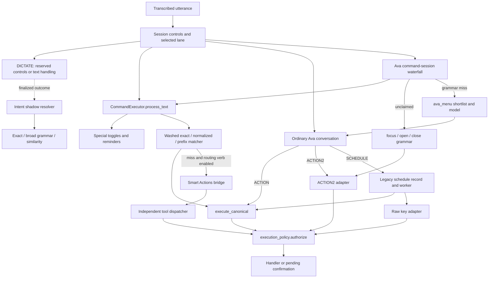

MODEL: gpt-6-astra

# Command system review — current working tree

Audit date: 2026-09-15, America/Los_Angeles. Repository: C:\Users\Morne\Projects\Samsara-dev.
Read-only review; the only file written is this report. No code changes, staging, commits, app restart, dictation import, live command execution, or full test suite.

## 1. Premise checks — before conclusions

| Brief premise | Verdict | Evidence |
|---|---|---|
| Review the working tree rather than HEAD | CONFIRMED. The initial status showed extensive concurrent uncommitted work. Relevant tracked history includes 3c2265f (unwired intent grammar), 8524647 (policy generations/confirmation), and 16da62a (policy). Those commits are provenance, not the audited implementation. | Shell evidence in Appendix E; all source readings and Python imports used working-tree files. |
| Read queue 113's decision if landed | UNVERIFIED / unavailable at the allowed path. Repeated Test-Path checks, including the final-pass check, returned False. I have not inferred its decision from edits appearing during this audit. | Appendix E. |
| 61 one-word canonicals and 21 multi-word canonicals with one-word aliases | CONFIRMED in the measured registry. These counts describe base phrases; a canonical display form with an argument placeholder is not a two-word command. | A1 and A2. |
| Queue 107's 86 unvalidated / 24 model-disallowed default candidates | STALE for this tree. Final measurement: zero unvalidated, 50 model-disallowed, 218 offered, out of 268 default/scope/AI-visible candidates. The 50 are 24 builtins and 26 plugins. | A1 and A6; historical C:\Users\Morne\Documents\Claude\reports\107\FINAL.md, section 1. |
| One execution API and scope/pack checks cover every route | PARTLY IMPLEMENTED, but the universal claim is STALE. Registered ACTION/spoken commands share an executor; ACTION2, Smart Actions, special preprocessing, and some delayed callbacks retain materially different paths. | samsara/commands.py:436; samsara/execution_policy.py:417; A3–A5. |
| Queue 99 consolidated number parsing | CONFIRMED for counted scratch's reuse of normalize.parse_number; STALE if interpreted as every parser/caller being unified. | samsara/session_modes.py:289; samsara/intent/normalize.py:200; samsara/execution_policy.py:1611; plugins/commands/show_numbers.py:1349. |
| General intent grammar and Ava session grammar might be the same | They are different implementations. The general resolver observes; the Ava grammar executes. | samsara/intent/grammar.py:174; samsara/ava_command_session.py:125; dictation.py:8723. |
| Canonical catalog is every surface's single source | PARTLY IMPLEMENTED. Catalog-backed guidance exists; runtime registry menus, handwritten help, config-derived quick reference, and a saved-catalog fallback coexist. | Section 8 and A2/A6. |
| Branch must remain feature/v0.22 | CONFIRMED before and after review. | Appendix E. |

Evidence labels used throughout:

- **IMPLEMENTED**: established by current source inspection; not proof it worked in a running app.
- **VERIFIED (SIMULATED)**: a guarded fresh process exercised real registry/policy/parser code, with effects and network substituted where necessary.
- **VERIFIED (END-TO-END)**: reserved for actual speech → running app → observed target effect. **No finding in this audit has this status.**
- **UNVERIFIED**: unavailable or not exercised, including actual live-profile registration, microphone recognition, model quality/latency, and OS integration success.

Severity describes consequences; confidence describes the evidence. Recommendations are judgments, not measurements. Relative file:line citations refer to the repository above. Appendix probes give executable reproduction and observed output.

## 2. The paragraph to hold in your head

Samsara currently has **one main phrase registry and a partly shared execution policy, surrounded by several interpreters**. Ordinary command dispatch matches normalized exact phrases or prefixes; Ava command sessions add a small app-verb grammar and then a model shortlist; conversational Ava emits ACTION, ACTION2, or schedules; Smart Actions has its own tool list and dispatcher. The much broader intent grammar is still an observer, not the resolver driving those paths. The catalog describes much of the registry and powers some guidance, but is not yet the authoritative executable tool contract. This is a consolidation in progress: shared foundations are real, while command identity, arguments, target binding, outcomes, and discovery still disagree at the joins. **IMPLEMENTED; high confidence.** [samsara/commands.py:582; samsara/ava_command_session.py:410; plugins/commands/ask_ollama.py:1214; samsara/smart_actions_tools.py:214; dictation.py:8723; samsara/command_catalog.py:563]

## 3. Measured baseline

All figures below are **VERIFIED (SIMULATED)** with the A0 guarded bootstrap and A1/A2/A6 probes. They are not readings of the already-running application.

| Thing counted | Measured value | What it means |
|---|---:|---|
| commands.json builtin declarations | 288 | Dictionary entries; equivalent shortcuts are not merged into semantic actions. |
| Plugin source files / successfully loaded modules | 37 / 37 | Excludes underscore-prefixed module files. Services are not started: executor constructed without an app. |
| Plugin declarations / unique registered handler entries | 205 / 205 | Before the combined matcher drops shadowed canonicals. |
| Combined matcher commands | 487 | 288 builtins + 199 retained plugin commands. Six plugin canonicals are shadowed. |
| Fresh catalog / saved catalog records | 487 / 487 | Equal record counts do not imply equal content. |
| Plugin declared alias memberships | 509 | Additional alias list entries, before collision deduplication. |
| Plugin canonical-plus-alias memberships / unique plugin phrase keys | 714 / 707 | Different measures; aliases can share strings. |
| Combined matcher's exact phrase keys | 980 | Lookup-map keys. |
| Fresh catalog canonical-plus-alias memberships | 981 | Includes canonical phrases, so **not** 981 extra aliases. Additional memberships: 494. |
| Distinct raw claimed phrases | 991 | Includes claims lost at load time. |
| Frozen collision / orphan counts | 9 / 13 | Still present; see section 6. |
| One-word canonical bases / multi-word bases with one-word aliases | 61 / 21 | A2 lists the alias-bearing phrases. |
| Source-default packs | 12 | Listed below. |
| Enabled-pack, empty-scope candidate commands | 310 | Eligible registry entries, not guaranteed successful executions. |
| Live / enabled-total phrase counts in that context | 589 / 618 | The matcher reports this pair; scoped phrases account for the difference. |
| Same default profile with window_cube.visible tag | 319 commands; 607 / 618 phrases | Demonstrates why reachability needs a scope, not just a catalog count. |
| Default/scope/AI-visible candidates | 268 | 171 builtin + 97 plugin candidates. |
| Ava menu | 218 | 147 builtin + 71 plugin; 3,076 characters, below the 4,500-character budget. |
| Authorization of menu candidates with no args | 205 low-risk; 13 confirmation; 50 model-disallowed; 0 unvalidated | Offered does not mean the handler can use an empty invocation. |
| Current plugin declared-risk distribution | ui 73, unknown 52, write 22, safe 17, reversible 15, read 14, destructive 12 | All 205 plugin declarations, a different denominator from the default menu. |
| Python files in samsara/intent | 5 | __init__.py, grammar.py, normalize.py, resolve.py, shadow.py. |

Default packs measured from get_enabled_packs({}): accessibility, alarms, browsers, core, health, media, session, smart-actions, tasks, text-editing, window-cube-numbers, window-management. [A1; samsara/command_packs.py]

**A defensible live-default claim is narrower than “310 commands work.”** Notepad, Chrome, Stremio and empty foreground contexts each produced 310 candidates under the source-default packs; an overlay tag changes that. Required arguments, optional software/devices, current state, mode gates and handler success remain separate conditions. The application's default command-mode flags are false, so these numbers do not mean every ordinary dictated utterance is command-matched. The actual running app could also predate the current tree. **Source-default eligibility VERIFIED (SIMULATED); live reachability UNVERIFIED.** [A2; dictation.py:3824; samsara/commands.py:676]

The audit caught concurrent metadata changes: the first complete measurement had nine unvalidated and 41 model-disallowed candidates; the final repeated measurement had zero and 50, with the same 218 menu entries. This report uses the latter. It does not conclude that all plugin metadata is complete: 52 plugin declarations remain unknown outside that default candidate subset. [A1/A6]

## 4. Actual resolution and execution paths

### 4.1 Flow



This diagram separates **sharing authorize** from **sharing an executable registry contract**. Synthetic IDs reach authorize but do not inherit a registered command's pack/scope identity. Special preprocessing does not reach authorize at all. The observer has no arrow to effects. **IMPLEMENTED; A3/A4 demonstrate the boundary differences.** [samsara/execution_policy.py:439; samsara/commands.py:640; dictation.py:8723]

### 4.2 Vocabulary, effects and misses

| Path | Vocabulary and permitted effects | Miss / disagreement behavior | Evidence |
|---|---|---|---|
| Session router | Whole-utterance stop/sleep/switch/scratch and reserved hands-free controls; COMMAND, DICTATE and AVA remain distinct. Direct text/edit control callbacks are not simply catalog commands. | COMMAND misses remain command misses. DICTATE normally handles text, with reserved controls first. This context precedes phrase matching. | **IMPLEMENTED:** samsara/session_modes.py:1925, :2685, :2806, :3127; dictation.py:7448. |
| Spoken command matcher | Builtins + retained plugins, phonetic wash for matching, token-normalized exact lookup then longest prefix; original remainder restored for plugin arguments. Packs and scopes constrain matching. | Exact disabled/scoped phrases are diagnosed as misses. Unclaimed routing verbs can go to Smart Actions; otherwise caller receives a miss. A builtin prefix drops the remainder. | **IMPLEMENTED / SIMULATED:** samsara/commands.py:684, :706, :726; samsara/command_registry.py:579; A3/A4. |
| Smart Actions fallback | Configured first-word verbs, default ask/plan/summarize, only after registry miss and when enabled. Bridge advertises a separate tool list; capture can fall back to a brain-dump path if agent integration is unavailable. | Does not consult the Ava shortlist. Tool refusal is handled inside its dispatcher; routing reports queued after calling the bridge helper. | **IMPLEMENTED:** samsara/commands.py:766; plugins/commands/smart_actions.py:279; samsara/smart_actions_bridge.py:24; samsara/smart_actions_tools.py:214. |
| Ava command session | Stage A invokes full process_text with force_commands; therefore it can include Smart Actions fallback, not merely exact matching. Stage B accepts focus/open/close synonyms and fillers; stage C asks one model with ava_menu's top 12. | Claimed failed/rejected stage A does not fall through, correctly preventing reinterpretation. Stage B ignores ActionResult and records a hit. Stage C uses returned outcome but retains a legacy None-as-success compatibility case. | **IMPLEMENTED / SIMULATED:** samsara/ava_command_session.py:125, :191, :273, :410; A4. |
| Ordinary Ava | Shared ava_menu names in its prompt. ACTION names a spoken registry ID without typed arguments; ACTION2 carries verb plus argument; SCHEDULE carries interval and command or raw KEY target. Conversation text can instead be spoken. | ACTION refusal becomes a TurnOutcome. ACTION2 has its own adapter/target lookup. Ordinary conversation does not use the command session's shortlist-membership check. | **IMPLEMENTED:** plugins/commands/ask_ollama.py:1030, :1173, :1214, :1319. |
| General intent package | Catalog-derived records, filler/normalization rules, broader verb families/slots, command chains, scope, similarity suggestions and one-word restrictions. Its third tier is similarity, **not a model call**. | Returns resolved/suggest/dictation; no production effect. Disabled packs are not excluded by its scope-only view. It can predict actions production dispatch refuses. | **IMPLEMENTED / SIMULATED:** samsara/intent/resolve.py:138, :171, :283, :352; samsara/intent/grammar.py:402; dictation.py:8723; A3. |
| Schedule | Legacy confirmation dictionary, then repeating thread. Each command tick uses execute_canonical under SCHEDULE; raw keys use a synthetic key ID plus policy. | Scope refusal can wait for scope to return; other rejected command outcomes stop the schedule. Worker cancellation uses separate events per schedule. Parser accepts interval zero. | **IMPLEMENTED / SIMULATED:** plugins/commands/ask_ollama.py:1294, :1375, :1470; A5. |
| Confirmed callbacks and repeat | PendingOperation supports generation, expiry, single use, argument hashes and optional target versions. Registered executor callback reauthorizes. Repeat has special history-binding code. | Target checks occur only if caller supplied targets/probe. Confirmed plugin repeat uses the wrong registry key and can fail after approval. | **IMPLEMENTED / SIMULATED:** samsara/commands.py:541; samsara/execution_policy.py:967, :1090; A4/A5. |
| Macros / legacy plugin executor | Builtin macro handler runs a list of keys/text/waits; plugin macros can call OS functions directly after outer authorization. Exported plugin_commands.execute_command directly calls func. | Internal macro steps do not each traverse the main invocation boundary. No production callsite of the exported legacy executor was found in the scoped search; distinguish a dormant alternative API from an active bypass. | **IMPLEMENTED:** samsara/handlers.py:283; plugins/commands/macros.py:38; samsara/plugin_commands.py:285; Appendix E search. |

The stop-first generation invalidation, shared registered-command menu, and refusal to reinterpret an already-claimed command are sound foundations. **IMPLEMENTED**, not a blanket end-to-end certification. [samsara/execution_policy.py:655; samsara/commands.py:388; samsara/ava_command_session.py:423]

### 4.3 Where the same utterance can disagree

A3 compares raw matcher results before process_text's phonetic wash with the Ava grammar and the observer, using the same fresh registry/default scope. It is a parser comparison, not an acoustic or whole-app test.

| Input / circumstance | Difference observed or established |
|---|---|
| copy / help | Matcher finds commands; observer treats the one-word utterance as dictation. |
| copy this sentence | Matcher claims copy with leftover text; real builtin execution discards the leftover and completes the copy sink. Observer produces a suggestion. |
| please copy | Matcher and app-verb grammar miss; observer's filler stripping still ends in its one-word restriction. A model could propose a command, but that model outcome is UNVERIFIED. |
| open notepad | Default matcher refuses the disabled utilities entry; Ava app grammar recognizes open+notepad; observer resolves the disabled builtin because it lacks pack filtering. |
| please close notepad | App grammar recognizes close; observer demotes the one-word base command. Registered close is WRITE via reversible metadata; synthetic ACTION2 close is DESTRUCTIVE. Different adapters can therefore apply different confirmation rules to the same operation. |
| lights on | Default matcher misses disabled smart-home; observer resolves it. |
| make it louder | Neither exact matcher nor narrow app grammar resolves it; broader observer grammar resolves volume up. Its zero word-penalty means the “inexact only suggests” rule is not equivalent to literal alias-only recognition. |
| volume up and copy / scroll down then paste | Matcher claims the first command and passes trailing words as remainder. Observer chain rules can demote the result because a member is one-word. There is no shared chain executor here. |
| A phrase inside an ordinary paragraph containing command mode off | process_text's substring toggle can change configuration before normal matching/authorization; whole-utterance session switching follows different rules. |
| open through registry vs ACTION2 with window-management disabled | Registered invocation is refused; synthetic ACTION2 is allowed. |
| Same command before/after foreground changes while asking yes | Registered policy rechecks current scope; generic confirmation does not bind the original target. It can therefore authorize against a different foreground target. |
| new conversation / switch to / what can I say / morning routine | Collision winner defines one meaning and can entirely remove another command's aliases. Pack enablement does not restore a declaration dropped at load. |
| Same proposed operation as ACTION vs SCHEDULE or Smart Actions tool | Different command IDs, argument protocols, risk sources and route classifications. SCHEDULE is a USER_ROUTE after the schedule confirmation; Smart Actions has its own tier-derived risk. This is a policy distinction requiring an explicit contract, not automatic equivalence. |

**Evidence:** A3–A5; samsara/commands.py:640; samsara/command_registry.py:473; samsara/intent/resolve.py:283; samsara/intent/grammar.py:473; samsara/execution_policy.py:86, :183. Actual model selection for any natural-language example remains **UNVERIFIED**.

## 5. Findings, ranked separately by severity and confidence

### F1 — Pack/scope enforcement is shared only for IDs that resolve into the registry

**Severity: HIGH. Confidence: HIGH. VERIFIED (SIMULATED).**

With window-management disabled, authorize rejects registered open with pack_disabled but allows action2:open with low_risk. Synthetic ACTION2 IDs are recognized by policy without becoming the owning registry entry; command_availability cannot apply that entry's constraints. Smart tool IDs and raw key IDs are similar separate namespaces, although their intended pack ownership needs a product decision rather than guessing it. [A3; samsara/commands.py:344; samsara/execution_policy.py:417, :439]

The availability check also fails open on an exception: injecting a failing checker changed disabled volume up from pack_disabled to low_risk. This is a simulated fault, not evidence that the live checker currently throws. Fix the failure behavior and require an explicit owner/availability contract for every effect adapter. [A3; samsara/execution_policy.py:428]

### F2 — Approval and cancellation identity do not consistently reach the eventual effect

**Severity: HIGH. Confidence: HIGH. VERIFIED (SIMULATED).**

A model close-window invocation queued a real PendingOperation with empty targets and no target probe. Changing the simulated foreground from A to B before approving caused the stubbed handler to act on B. The primitive supports target binding; the generic caller does not supply it. ACTION2 and Smart Actions confirmation callers likewise omit target bindings. Target-aware cancel-window code demonstrates that the building block already exists. [A4; samsara/commands.py:541; plugins/commands/ask_ollama.py:1351; samsara/smart_actions_tools.py:329; samsara/execution_policy.py:1507]

A fake delayed Smart Actions response bumped generation from 0 to 1 before delivering a tool call. The real dispatcher captured generation 1 at receipt and called the effect sink, even though the request originated at 0. Capture request identity before bridge work; carry it through the reply, tool dispatch and approval. Most nonempty tool calls currently fail schemas (F5), so the demonstrated path used an accepted empty notification call. Do not generalize that into proof every current tool executes stale. [A4; plugins/commands/smart_actions.py:316; samsara/smart_actions_tools.py:241]

### F3 — Some utterance-triggered effects precede authorization

**Severity: HIGH. Confidence: HIGH. VERIFIED (SIMULATED).**

A stale invocation containing the substring command mode off still changed the in-memory matching flag and called the save-config sink. A stale reminder invocation still called the reminder sink. Both special branches precede command matching and authorize. The substring trigger also violates the stricter whole-utterance behavior used for session controls. These are genuine exceptions to “one chokepoint.” [A3; samsara/commands.py:640, :666]

This is separate from intentional session stop/abort controls: those need to remain available before ordinary dispatch, but can have explicit, narrow semantics. Moving every safety exit behind optional command-pack gating would be the wrong repair. [samsara/session_modes.py:1951; samsara/execution_policy.py:655]

### F4 — Structured outcomes still depend on handlers that do not tell the truth

**Severity: HIGH. Confidence: HIGH. VERIFIED (SIMULATED), with related source-only cases identified.**

A stubbed app resolver returned NOT_FOUND, but registered open returned COMPLETED because its handler reports True after speaking a failure. The Ava grammar stage recorded hit after its helper returned NOT_FOUND. Meanwhile open appears in ava_menu with empty arguments and then returns MISS: policy eligibility is not executable argument completeness. [A3/A4; plugins/commands/app_verbs.py:317; samsara/ava_command_session.py:434; samsara/commands.py:410, :490]

Confirmed plugin repeat is another concrete migration defect: stage_pending's callback indexes entry["handler"], while plugin registry entries use func. A real repeat invocation queued confirmation for a plugin; approve returned true while the callback logged KeyError('handler'). Approval acceptance is not successful effect completion. [A5; samsara/execution_policy.py:1115; samsara/plugin_commands.py:166]

Related **IMPLEMENTED** defects need handler-specific verification: MethodHandler ignores a method's return; TextHandler reports True even after its caught error path; macro handling can skip a failed step and return True. A return adapter cannot repair a handler that already discarded the result. [samsara/handlers.py:254, :283, :339]

### F5 — Tool schemas are descriptions, adapters and policy inputs that still disagree

**Severity: MEDIUM. Confidence: HIGH. VERIFIED (SIMULATED) / IMPLEMENTED.**

execute_canonical accepts spoken registry phrases/aliases, not namespaced catalog IDs: builtin.copy is rejected. Plugins receive only app and a remainder string. In an in-memory schema fixture, a validated target argument was accepted but the handler received an empty remainder. That fixture demonstrates adapter loss; it is not a claim that current open declares target. The actual open schema declares optional remainder even though its handler needs a target. [A3/A5; samsara/commands.py:460, :490; plugins/commands/app_verbs.py:317]

Smart Actions advertises ten tools with its own schemas, but execution_policy.SMART_ACTION_SCHEMAS is empty. show_notification with message is unvalidated; an empty call passes the low-risk exception. Populating metadata to admit calls without implementing real argument/effect adapters is not completion. [A3; samsara/execution_policy.py:340; samsara/smart_actions_bridge.py:24; samsara/smart_actions_tools.py:42]

The command-session closed-world gate checks ACTION membership and ACTION2 verb, but does not enforce its stated restriction that ACTION2's argument must be grounded in the utterance. An arbitrary argument passes that predicate. Actual model fabrication frequency is UNVERIFIED; the missing predicate check is verified. [A3; samsara/ava_command_session.py:244]

### F6 — Permitted collision debt changes meanings and deletes useful vocabulary

**Severity: HIGH for the demo collision; MEDIUM for the remaining navigation/discovery debt. Confidence: HIGH. IMPLEMENTED / VERIFIED (SIMULATED).**

The frozen snapshot is a regression baseline, not evidence the collisions are acceptable. “Morning routine” resolves to a core-pack demo which starts media, flashes screens, strobes lights and opens a video; it shadows the separate macro intended to open daily sites and set volume. “What can I say” resolves to handwritten spoken suggestions while show quick reference is orphaned. See the full debt table below. [A2/A5; plugins/commands/demo_commands.py:41; plugins/commands/macros.py:81; plugins/commands/core_utils.py:141; tests/command_catalog_known_collisions.txt:1]

### F7 — Discovery can recommend commands unavailable under the same defaults

**Severity: MEDIUM. Confidence: HIGH. VERIFIED (SIMULATED) / IMPLEMENTED.**

The example selector, given fresh catalog records, produced 316 phrases; 98 were unavailable under default packs. It filters risk/scope/hardware, but not enabled packs. Production's strip adapter also asks app.command_registry.rows(); the application wires command_executor._matcher instead, so the observed code path falls back to saved JSON. These are two independent defects: regenerate JSON alone will not fix availability filtering. [A5; samsara/ui/command_marquee.py:105, :366; samsara/ui/main_window_qt.py:446; dictation.py:2833]

Saved versus regenerated catalog differed in 108 records: 43 args, 23 risk, 16 undoable, 95 source fields, and one description (overlapping categories). Source-line shifts are not semantic drift; argument and risk differences are. Separate live-build functions differed in 28 argument definitions and six descriptions, and the guidance version omits source/undoable altogether. This is not simply a stale-file problem. [A2/A6; samsara/command_catalog.py:378, :563]

### F8 — Shadow evidence and future safety rules are being judged against a different command universe

**Severity: MEDIUM now; HIGH if enabled for effects unchanged. Confidence: HIGH. VERIFIED (SIMULATED) / IMPLEMENTED.**

The observer ignores disabled packs and rejects one-word canonicals even when a longer utterance supplies a target. It also has grammar rules such as make it louder that produce a zero penalty and pass the supposedly exact-only rule. These choices can be legitimate policies, but they are not the same policy as production and are not all captured by the label “exact.” Compare against intended user outcomes, not merely whether shadow agrees with the current dispatcher. [A3; samsara/intent/resolve.py:171, :283; samsara/intent/grammar.py:473]

### F9 — Schedule parsing accepts zero without an effect-rate bound

**Severity: MEDIUM. Confidence: HIGH for acceptance; MEDIUM for operational impact.**

**VERIFIED (SIMULATED):** CONFIRM Repeat copy? followed by SCHEDULE 0 copy parses as a zero-second schedule. **IMPLEMENTED:** the worker waits with timeout=interval without a lower bound, so a confirmed zero interval can repeatedly fire without a timed delay. No worker was started in this audit. Argument validation belongs before presenting the confirmation and again at worker creation. [A5; plugins/commands/ask_ollama.py:1173, :1294, :1470]

The per-worker stop-event repair is sound in source; this review does not reopen the older shared-event bug. [plugins/commands/ask_ollama.py:1470, :1510]

## 6. Vocabulary: collisions, short phrases, aliases, slots

### 6.1 Every currently permitted collision

Winners are measurements, not guarantees under every possible plugin import order. Plugin loading uses an unsorted glob; the plugin map and combined matcher have different overwrite/skip mechanics. Rejecting ambiguity at registration is preferable to depending on that order. [A2; samsara/plugin_commands.py:191, :425; samsara/command_registry.py:453]

| Phrase(s) | Measured winner / other claimant | Judgment and repair |
|---|---|---|
| morning routine | demo_commands.wake_me_up / macros.morning_routine | Unsafe semantic substitution. Give the demo an explicit demo-only phrase/pack; preserve the daily routine's own identity. |
| new conversation | ask_ollama.ava_forget / smart_actions.new_conversation | Different session stores: Ava memory versus Smart Actions session. Name the target or unify the session reset operation. AI pack being off can leave the Smart Actions reset unavailable despite its own pack being on. |
| next song; next track | media_keys.next_track_this / music.next | Focused-app command versus current media-session transport. They need explicit target semantics, not an assumption that both mean Spotify. |
| pause music | media_keys.pause_this / music.pause | Same target ambiguity; choose a documented default and keep explicit focused-app/media-session alternatives. |
| scroll to bottom; scroll to top | builtin / scroll plugin | Candidate for one implementation with merged aliases, after verifying the key/effect behavior is equivalent. Do not silently discard plugin aliases. |
| switch to | app_verbs.focus / audio_switch.switch_to | App focus and audio-device switching are different namespaces. Keep explicit switch audio to for the latter. |
| what can i say | core_utils.what_can_i_say / app_lifecycle.what_can_i_say | Spoken handwritten tips versus opening quick reference. Define one generated help entry point; preserve show quick reference as a reachable explicit action. |

**IMPLEMENTED / SIMULATED evidence:** A2; plugins/commands/ask_ollama.py:2331; plugins/commands/smart_actions.py:224; plugins/commands/media_keys.py:133, :163; plugins/commands/music.py:405, :412; plugins/commands/audio_switch.py:30; plugins/commands/app_lifecycle.py:330.

The 13 orphan strings are bottom of page, fresh start, go to bottom, go to top, good morning, jump to bottom, jump to top, reset conversation, show quick reference, start my day, switch audio to, top of page, use. They are not merely hidden by a disabled pack: their owning command was dropped at combined-registry construction. [A2; samsara/command_registry.py:473]

To empty the debt file: resolve each semantic owner, merge aliases only for equivalent effects, rename separate meanings, restore useful orphan aliases, then require zero collisions/orphans in the generator/test. Replace the frozen acceptance entries with tests for the intended winner/target. Regenerating the snapshot without those repairs merely renews the debt. **Recommendation.** [tests/command_catalog_known_collisions.txt:1; samsara/command_catalog.py:427]

### 6.2 A mandatory two-word canonical form is the wrong primary rule

**Judgment:** use action families with explicit targets/slots, and gate them by interaction context. “Copy” is a reasonable command in an explicitly armed command interaction. “Open Notepad” already contains an action and target even though the base canonical is open. Renaming copy to copy selection could improve discoverability, but should not force unnecessary words on every voice interaction or claim to solve accidental activation.

The measured 61 include punctuation, app verbs with arguments, numbered overlays and media controls—different interaction types. The 21 additional alias-bearing commands include show numbers→show, volume up→louder, hey ava→ava, and what can I say→help. Canonical renaming alone leaves the alias behavior intact; eliminating every short alias would add effort and remove useful context-specific speech. [A1/A2; samsara/intent/resolve.py:283]

Keep complete-utterance consumption for zero-argument commands; require typed slot consumption for parameterized commands; use explicit command intent/active subject/context for short verbs. During dictation, ambiguous text must stay text or request clarification. Validate addressing and false actions with labeled user-intent examples, not word count as a proxy. **Recommendation; user-outcome accuracy UNVERIFIED.**

### 6.3 Aliases are predominantly authored, not generated

The decorator accepts literal alias lists and registers them. Catalog generation gathers and normalizes those claims; it does not generate a consistent synonym family. General intent grammar has its own verb classes and composition rules, but those do not populate the production registry. Existing builtin entries can also encode alternate wording as separate commands rather than aliases of one action. **IMPLEMENTED / SIMULATED:** 509 plugin alias memberships; samsara/plugin_commands.py:83, :169; samsara/command_catalog.py:378; samsara/intent/grammar.py:36; A6.

Generate a deliberately small family vocabulary from reviewed action schemas, with explicit exceptions. Do not generate an unconstrained Cartesian product of synonyms: that would make collision and ambiguity harder to reason about. Keep matching aliases distinct from acoustic normalization and from model paraphrase examples. **Recommendation.**

### 6.4 Slot consolidation: useful reuse, not one parser yet

| Slot | Actual ownership / remaining duplication |
|---|---|
| Numbers | normalize.parse_number adds whole-input and look-alike checks, then delegates to show_numbers._parse_spoken_number. Counted scratch now calls it. Show Numbers still directly calls its older parser; choice replies have a separate narrow _spoken_number table. Different acceptance grammars can be justified, but should wrap one numeric-value primitive rather than accidentally diverge. |
| Ordinals | normalize reads windows._ORDINALS and adds numeric suffix handling; Windows' own command parsing still interprets its syntax separately. |
| NATO letters | normalize wraps window_switcher.PHONETIC and letter parsing; window-switcher handlers still call their local parser directly. This shares data/implementation, not all entry-point validation. |
| App names | General grammar builds app-name candidates for slots; executable app_verbs resolves live windows/configured app identities; windows.py has its own window matching/placement parsing. Ava's narrow grammar passes free-text targets to app_verbs. Lexical parsing and live target resolution are legitimately separate jobs; their output contract is missing. |
| Free text / action arguments | Production plugins primarily receive remainder strings and parse them individually. Catalog hint/inference schemas and model-visible invocation syntax are not yet one executable argument contract. |

**IMPLEMENTED:** samsara/intent/normalize.py:182, :200, :221, :252; samsara/session_modes.py:289; plugins/commands/show_numbers.py:1349, :1397, :2167; samsara/execution_policy.py:1611; plugins/commands/window_switcher.py:78, :105, :725; plugins/commands/windows.py:223, :352, :421; samsara/intent/grammar.py:267; plugins/commands/app_verbs.py:185; samsara/commands.py:490.

## 7. What authorize actually enforces

Current order, **IMPLEMENTED** in samsara/execution_policy.py:833:

1. Reject missing/stale generation.
2. Verify command existence, including synthetic key/ACTION2/Smart Actions namespaces.
3. Ask command_availability for pack/scope restrictions; missing/throwing checkers do not block.
4. For repeat, authorize the stored target instead and check the builtin snapshot where applicable.
5. Classify risk/reversibility/schema. Model routes require declared metadata; user routes can use saved catalog risk for otherwise unknown plugins.
6. Validate arguments. The zero-argument read/UI exception admits undeclared schemas.
7. Enforce model callability for MODEL/SMART_ACTION.
8. A confirmed invocation bypasses the remaining prompt decision, but not the earlier checks.
9. Allow read/UI, exact known-safe exceptions, user-route writes, and exact reversible destructive operations; otherwise ask confirmation.

The core is worthwhile. The statement “every action passes this policy with the same identity and metadata” is not yet true. In particular, voice_triggerable, preconditions and ai_composable are not authorization checks here. The going dark voice flag is false, but an enabled-pack exact invocation reaches confirmation rather than being refused as non-triggerable. That may be intended descriptive metadata; it must not be described as an enforced restriction. [A5; samsara/command_registry.py:498; samsara/execution_policy.py:833]

**Risk is doing too many jobs.** safe maps to UI, reversible maps to WRITE, destructive plus inferred reversibility can run without confirmation on an exact route, and Smart Actions' approval tiers become effect risk. append_to_file is AUTO, therefore UI, even though it writes a file. Catalog risk uses phrase heuristics; undoable is a guess; the saved file can feed user-route policy. None is an adequate replacement for an actual inverse operation or explicit target/blast-radius contract. [samsara/execution_policy.py:185, :356, :937; samsara/smart_actions_tools.py:42; samsara/command_catalog.py:184, :206]

**Recommendation:** retain a readable risk summary for UI, but give policy separate facts: effect type; target and scope; parameter schema; model eligibility; confirmation requirement; reversibility with a real inverse/capability; and operation size. Model-created schedules should retain origin provenance even after a user approves a bounded schedule. “User confirmed” and “originally spoken exact” are different facts.

The 107 advice to add a safe declaration as a one-line capability fix is too broad. Honest metadata helps—and the current 71 offered plugins show progress—but does not fix missing arguments, failed effects, wrong targets, stale replies, or adapter identity. [A1/A3/A4; C:\Users\Morne\Documents\Claude\reports\107\FINAL.md, section 1]

## 8. Discovery and learnability

| Surface | Current source | Assessment |
|---|---|---|
| Cheat sheet | Live matcher rows → guidance_catalog; scope annotation; disabled-pack annotation. Production supplies the correct commands callback. | Substantially consolidated. Preserve it; make availability and invocation requirements authoritative rather than guessing from descriptive rows. |
| Quick reference | Runtime config, session switch definitions, invocation phrases, hotkeys, formatting tokens. | This is correctly config/session-derived guidance, not necessarily a catalog failure. It must not pretend every session control is an ordinary registry command. |
| Status-strip example | guidance_catalog via app.command_registry.rows if present, otherwise saved JSON; independent risk/argument/scope selector. | Wrong live adapter and missing pack filtering; see F7. |
| what can I say | Winning core_utils handler uses _APP_SUGGESTIONS and a fallback string. | Handwritten and context-limited; does not open the competing quick-reference handler. This contradicts the intended generated-help front door. |
| Tutorial | Reads app.command_executor._matcher, builds guidance catalog, selects examples from enabled packs; some sections resolve named catalog IDs. | Real reuse. Its examples still depend on the guidance projection's argument inference and do not themselves establish executable success. |
| Conversational Ava / Ava session shortlist | Both use ava_menu and shared menu_score over registry entries, with authorize deciding membership. | Genuinely unified menu membership/ranking. The remaining issue is the execution contract, not a need for another menu builder. |

**IMPLEMENTED:** samsara/ui/command_cheatsheet_qt.py:49, :97, :164; dictation.py:2833; samsara/ui/quick_reference_qt.py:138, :235, :351; samsara/ui/command_marquee.py:105, :366; plugins/commands/core_utils.py:147; samsara/ui/tutorial_qt.py:66, :91; samsara/commands.py:388; plugins/commands/ask_ollama.py:1030; samsara/ava_command_session.py:191.

**Judgment:** at this size the learnable unit should be a task family and its target—windows, text, media, capture—not a list of 487 canonical strings. Teach a few patterns plus the commands available here, expose exact alternatives when asked, and let a model map paraphrases into those same typed operations. Discovery must answer “what works now, on what, with which required information?” The catalog's total is a coverage statistic, not a user instruction.

## 9. Half-migrations and duplications

This is a ledger of the reviewed subsystems, not a claim to have audited every optional integration.

| Migration | What landed | What remains / duplicate mechanisms |
|---|---|---|
| Unified command registry | Builtins/plugins share matching and source-default pack/scope filtering. | Colliding plugin canonicals disappear with aliases; plugin registry and combined registry still apply different collision rules. |
| Canonical catalog | Namespaced records, generation, collision tooling, guidance consumers. | Executable API speaks phrase IDs; saved catalog plus two live projections differ; policy still falls back to saved heuristic risk. |
| Typed arguments | Declared param_schema, validation, catalog args, broad grammar slots. | Remainder-only handler adapter; ACTION has no args; ACTION2 and Smart tools use separate schemas; body-based inference differs by catalog builder. |
| Single executor | Spoken match, ACTION and scheduled named commands share execute_canonical. | Synthetic app/key/tool adapters, special toggles/reminders, legacy direct executor and nested macro effects remain separate. |
| Truthful outcomes | DispatchResult/TurnOutcome, rejected/failed/queued states, stage-C propagation. | Handlers discard errors/results; stage-B hit unconditional; confirmed plugin-repeat callback mismatch; queued acceptance is not completed work. |
| One policy | Generation/existence/args/model/pack/scope decisions shared for registered invocations. | Synthetic identities bypass ownership, availability fails open, metadata flags not enforced, risk conflates separate questions. |
| One pending operation | Single-use approval primitive, hashes, generations, optional target versions. | Callers omit target binding; schedule keeps a legacy dictionary; repeat has bespoke callback; Smart bridge does not carry request generation. |
| One grammar | Narrow Ava app grammar is live; broad general grammar and resolver exist. | Two grammars remain; broad resolver is observer-only, pack-unaware, and has different one-word/inexact rules. |
| Shared number/letter parsing | normalize reuses plugin tables/parsers; counted scratch uses normalize. | Original direct callers and reply-number parser remain; app/ordinal interpretation still has separate entry points. |
| Generated aliases | Catalog records declarations and detects conflicts. | Production alias lists remain hand-authored; grammar synonyms are a separate vocabulary. |
| Unified discovery | Cheat sheet/tutorial catalog adapters; shared Ava menu; quick reference uses config. | Handwritten spoken suggestions, saved-strip fallback, separate example filters, no common availability/required-argument view. |
| Uniform undo | Text/edit-specific stack and refusal paths. | Command undo explicitly returns false; catalog undoability does not implement an inverse. |
| One mode-free interaction | Session routing and shadow evaluation provide groundwork. | COMMAND/DICTATE/AVA and a separately latched Ava command session remain real runtime concepts. |

**Evidence:** sections 4–8; samsara/session_modes.py:2685, :3197; samsara/execution_policy.py:1090; plugins/commands/ask_ollama.py:1294. All rows **IMPLEMENTED**; reproduced defects retain the stronger labels in section 5.

Not all duplication should be deleted: runtime configuration belongs in quick reference; lexical app parsing and live window resolution are different stages; model relevance ranking is not spoken exact matching. Unify the invocation, availability and effect contracts, rather than forcing every concern into one large parser. **Judgment.**

## 10. MAP versus VISION

Sources: C:\Users\Morne\Documents\Claude\SAMSARA_MAP.md:16 and :20; C:\Users\Morne\Documents\Claude\SAMSARA_VISION.md:12, :20, :29.

**Which does the code implement?** Ava command session is structurally closer to MAP's deterministic-first waterfall, but uses the narrow grammar rather than the general intent grammar. Ordinary Ava is model interpretation in its own lane. General dictation is not model-first and not yet gated by the observer. Therefore neither document describes the current whole application. **IMPLEMENTED.** [samsara/ava_command_session.py:410; plugins/commands/ask_ollama.py:1214; dictation.py:8723; samsara/session_modes.py:2685]

**My recommendation:** keep natural language as the user-facing destination, with exact matching as a latency optimization *after command intent/context is established*, and one typed invocation contract regardless of who parsed it. Do not interpret “primary interface” as a requirement to send every known command through a model. Also do not treat every exact command-shaped utterance in dictation as permission to act. The decision about whether speech addresses Samsara is distinct from the decision about which command it names.

What is false **as a present-tense description**, or unsupported as a shipping claim:

- MAP's single lane and broad exact→grammar→model gate are not live; command-prefix execution still exists. Its latency bound is a target, not a measurement from this audit. [MAP:16–23; samsara/commands.py:684; dictation.py:8723]
- MAP's “command phrase alone is never typed” conflicts with normal text that happens to resemble a command. That is a product-policy conflict requiring labeled intent, not a parser trick. [MAP:20–21; samsara/intent/resolve.py:283]
- VISION's model-first, one-Ava, modes-disappear account is not the current routing structure. Its grammar-shrinks-to-slots direction is also different from the broad verb-family grammar being maintained. [VISION:12, :20–22; samsara/intent/grammar.py:36; samsara/session_modes.py:2685]
- Neither uniform undo nor every plugin as an executable typed tool is delivered by catalog metadata alone. Command undo explicitly refuses; plugins still receive remainder. [VISION:13, :16; MAP:23; samsara/session_modes.py:3197; samsara/commands.py:490]
- VISION's local-model latency and conversational addressing reliability remain UNVERIFIED here. A wrong ignored instruction may still be costly for a user relying entirely on voice; it should not be treated as free in the acceptance metrics. [VISION:14–15]

**Is the contradiction causing damage?** Yes at the contract/work-allocation level: the broad grammar and narrow executing grammar have different vocabularies; one-word restrictions can suppress otherwise valid parameterized actions in shadow; consumers are being described as unified while effects still diverge. The probes demonstrate those mismatches. They do **not** prove that a direction document caused each bug or that the inactive observer has already misexecuted user commands. [A3–A6; sections 5 and 9]

## 11. Exactly three things to do next, in order

### 1. Close the execution contract before broadening model reach

**Buys:** pack/scope restrictions, cancellation, confirmation and reported results mean the same thing across registered ACTION, app grammar, Smart Actions, schedules and repeats.

**Cost:** medium-to-large integration work across adapters, policy and outcome-returning handlers; focused tests with effects stubbed, followed by controlled live target checks. It is not a rewrite of speech capture or a request to replace the registry.

**Acceptance evidence:**

- Same operation by every supported route is refused for a disabled pack/out-of-scope target, and a failed availability check blocks it.
- A request canceled during a delayed bridge/model reply causes zero effects.
- A target changed after confirmation is refused/re-resolved rather than silently substituted.
- Zero-arg missing-target operations cannot be offered as ready-to-run.
- Missing app, failed paste, failed method, and repeated plugin failures report failed/refused, never completed/hit.
- Zero-interval schedules are rejected before staging.
- A small live test verifies the actual target and observed effect for representative app, text and media operations; until then label it simulated.

Address the ambiguous demo alias as part of this safety closure, before additional exposure. **Recommendation grounded in F1–F6/F9.**

### 2. Make a single executable command specification feed adapters and discovery

**Buys:** one identity, typed args, honest availability, collision-free vocabulary and consistent instructions.

**Cost:** medium migration by action family. Keep legacy remainder handlers behind explicit adapters while converting them; do not require a flag day for all 487 entries. IDs should survive phrase renames. Separate effects, inverse support, confirmation and model eligibility rather than adding more meanings to risk_class.

**Acceptance evidence:**

- Registry, model tools, saved export and guidance are projections of the same executable specs.
- All collision/orphan debt resolves to intentional owners; zero ambiguous registrations allowed.
- Every example offered under a profile is enabled and has satisfiable arguments in that context.
- The same operation ID/typed args reaches the same effect adapter from exact speech, grammar and model.
- One tested help entry point exposes current availability and required slots.
- Known-slot parsing fixtures agree across adapters where semantics are intended to match; deliberate differences are documented.

**Recommendation grounded in F5–F8 and section 9.**

### 3. Reconcile the direction documents and validate one routing policy

**Buys:** natural speech without another parallel command system, and evidence for changing dictation behavior.

**Cost:** a product decision plus a labeled evaluation corpus and a bounded pilot. Model addressing, latency and false-action rates need measurements; metadata edits cannot supply them.

**Acceptance evidence:**

- One short contract states when speech is dictation, command, conversation, ambiguous or ignored, and when a model may be used.
- MAP and VISION reference that contract instead of prescribing contradictory tier orders.
- Exact, slot-parser and model outputs produce the same typed invocation; the broad shadow grammar is either reused for a specific measured purpose or retired.
- Evaluation includes ordinary sentences containing command words, short valid commands, names/targets, disabled packs, app changes, stop during work, background speech and uncertainty.
- Report false actions, lost dictation, missed intended commands and latency separately. Require actual voice-to-effect evidence before deleting user-facing mode distinctions.

**Recommendation grounded in section 10.**

## 12. Stop doing

- Stop calling a shared authorize function “one execution system” until every effect carries the same command identity, arguments, origin and target.
- Stop marking commands safe simply to increase Ava's menu count. First make their declarations and adapters accurate.
- Stop expanding handwritten aliases or broadly generating synonyms before resolving current collisions and choosing a vocabulary contract.
- Stop using two-word canonicals as the main accidental-activation defense.
- Stop treating frozen collision snapshots as approval of the collisions.
- Stop equating a queued operation, approved confirmation, matched phrase or hit counter with an observed completed effect.
- Stop presenting saved/generated catalog records as the live application's reachability.
- Stop adding another interpretation path while the two existing grammars have no agreed relationship.
- Stop claiming uniform undo or E2E success from schema presence and simulated tests.

These are recommendations derived from the evidence above, not implementation changes.

## 13. Verification, limits, and audit trail

Focused verification: repeated guarded registry/catalog measurements plus six probe bodies (A1–A6), covering matching, policy, target binding, generation loss, outcome propagation, argument adapters, repeat confirmation, schedule parsing and discovery selection. **No pytest suite was needed or run; no full suite, Whisper model, microphone capture, real model call, network effect or OS command execution was performed.**

The A0 bootstrap prevents Python file writes/network connections/subprocess launches and forbids dictation import. It sets a nonexistent audit profile path, installs a null logger, preselects the temp directory, and suppresses one decorative temporary SVG write. Three import-time subprocess attempts were blocked; all 37 plugin modules still loaded. This is an isolated source-default construction with explicit limitations, not the live app.

An earlier harness version blocked tempfile's discovery writes and underloaded plugins; that result was discarded. A5's first draft used the wrong response-parser function name and stopped after earlier checks; corrected rerun exited zero. Only successful final outputs are used below. Assertions about OS behavior remain limited to source plus substituted effect sinks.

Material progress was written into this report during the audit, then consolidated here:
1. Read the attached request, project instructions, branch/status, tracked history and direction documents; checked for queue 113.
2. Built a guarded baseline and traced every requested route.
3. Exercised boundary failures with final effects replaced, then inspected collisions, discovery and slots.
4. Repeated measurements after concurrent metadata edits; separated changed counts from architectural findings.
5. Wrote this report, preserved the existing astra_review/SAMSARA_REVIEW_2026-09-15.md, and checked branch before/after.

**Not done:** no production fixes, commits, staged files, runtime profile verification, acoustic/model quality evaluation, performance benchmark or end-to-end validation. Queue 113's unavailable report was not reviewed. Optional integrations' actual external effects were not audited exhaustively.

The explicit “only file you write” instruction in this brief superseded the standing external LIVE_LOG/FINAL/REPORT convention. This report is the complete task artifact.

## Appendix A — reproducible guarded measurements

Run from the repository root using PowerShell and F:\envs\sami\python.exe. A0 defines the shared source-only bootstrap; each following block starts a **fresh process**. Do not concatenate probe bodies into one process: some intentionally replace in-memory handlers/configuration. The probes never import dictation. Synthetic phrases below are test fixtures, not captured user dictation.

### A0. Shared bootstrap

```powershell
$auditPrelude = @'
import sys, os, io, json, logging, contextlib
from pathlib import Path
from collections import Counter
from types import SimpleNamespace
sys.dont_write_bytecode = True
os.environ['SAMSARA_HOME_DIR'] = str(Path.cwd() / '.audit-no-profile')
logging.getLogger().addHandler(logging.NullHandler())
import tempfile
tempfile.tempdir = os.environ['TEMP']
blocked = []
def guard(event, args):
    if event == 'open' and str(args[0]).lower() not in ('nul', 'nul:') and ((isinstance(args[1], str) and any(c in args[1] for c in 'wax+')) or (isinstance(args[2], int) and args[2] & (os.O_WRONLY | os.O_RDWR | os.O_CREAT | os.O_TRUNC))):
        blocked.append((event, str(args[0])))
        raise PermissionError('read-only audit')
    if event in ('os.mkdir', 'os.remove', 'os.rename', 'os.rmdir', 'subprocess.Popen', 'os.system', 'socket.connect'):
        blocked.append((event, str(args[0]) if args else ''))
        raise PermissionError('read-only audit')
    if event == 'import' and args[0] == 'dictation':
        raise RuntimeError('dictation import forbidden')
original_write_text=Path.write_text
def suppress_asset_write(path, data, *args, **kwargs):
    if path.name == 'samsara_theme_combo_arrow.svg':
        return len(data)
    return original_write_text(path, data, *args, **kwargs)
Path.write_text=suppress_asset_write
sys.addaudithook(guard)
from samsara.commands import CommandExecutor
from samsara import command_catalog as cc, plugin_commands as pc, execution_policy as ep
from samsara.command_packs import get_enabled_packs
capture=io.StringIO()
with contextlib.redirect_stdout(capture), contextlib.redirect_stderr(capture):
    executor=CommandExecutor()
from samsara.command_scope import MatchContext
context=MatchContext()
executor._matcher.set_context_provider(lambda: context)
app=SimpleNamespace(config={},command_executor=executor,_ava_cmd_generation=0)
executor._app=app
specs=cc.build_catalog(executor)
claims=cc.raw_phrase_claims(executor)

'@
```

### A1. Baseline inventory

```powershell
$auditProbe = @'
all_entries=list(executor._matcher._sorted)
live=executor.executable_entries(context)
visible=[e for e in live if executor._ai_visible(e)]
decisions=[(e,ep.authorize(ep.Invocation(e.phrase,{},ep.Route.MODEL,ep.current_generation(app),'',''),app=app,executor=executor,quiet=True)) for e in visible]
menu=executor.ava_menu(app=app,context=context)
one=[s.canonical_id for s in specs if len((s.verb+' '+s.object).split())==1]
onealias=[s.canonical_id for s in specs if len((s.verb+' '+s.object).split())>1 and any(len(a.split())==1 for a in s.aliases)]
catalog=json.loads(Path('commands_catalog.json').read_text(encoding='utf-8'))
print(json.dumps({
'builtin_declarations':len(executor.commands),
'plugin_files':len([p for p in Path('plugins/commands').glob('*.py') if not p.name.startswith('_')]),
'plugins_loaded':len(pc._LOADED_MODULES),
'plugin_declarations':sum(len(v) for v in pc._MODULE_ENTRIES.values()),
'plugin_registry_unique':len({id(e) for e in pc._REGISTRY.values()}),
'plugin_phrase_keys':len(pc._REGISTRY),
'live_registry_commands':len(all_entries),'live_registry_phrases':len(executor._matcher._entries),
'catalog_regenerated':len(specs),'catalog_file':len(catalog['commands']),
'catalog_matches_generated':cc.dumps(cc.to_document(specs))==Path('commands_catalog.json').read_text(encoding='utf-8'),
'catalog_total_aliases':sum(len(s.aliases) for s in specs),
'distinct_claimed_phrases':len(claims),
'collisions':len(cc.collisions(claims)),'orphans':len(cc.orphans(claims,specs)),
'one_word_canonical':len(one),'multiword_canonical_with_oneword_alias':len(onealias),
'default_packs':sorted(get_enabled_packs({})),
'default_empty_scope_commands':len(live),'default_empty_scope_phrases':executor._matcher.live_phrase_count(context),
'default_ai_visible_candidates':len(visible),
'model_denials':dict(Counter(getattr(d,'reason','allowed') for e,d in decisions)),
'model_menu':len(menu),'menu_builtin':sum(executor._registry_entry(x).source=='builtin' for x in menu),
'menu_plugin':sum(executor._registry_entry(x).source=='plugin' for x in menu),
'menu_characters':len(', '.join(menu)),
'model_denial_commands':{k:[e.phrase for e,d in decisions if getattr(d,'reason','')==k] for k in ('unvalidated','not_allowed_for_model')},
'one_word_ids':one,'one_word_alias_ids':onealias,
'blocked_import_side_effects_count':len(blocked),
'blocked_import_side_effects_first':blocked[:8],
'missing_plugins':sorted(set(p.stem for p in Path('plugins/commands').glob('*.py') if not p.name.startswith('_'))-set(Path(p).stem for p in pc._LOADED_MODULES)),
'load_output':[x for x in capture.getvalue().splitlines() if x.startswith(('[OK]', '[PLUGINS]', '[BOOT]'))]
},indent=2))
'@
($auditPrelude + "`n" + $auditProbe) | & 'F:\envs\sami\python.exe' -B -
```

Observed output (VERIFIED — SIMULATED):

```text
{
  "builtin_declarations": 288,
  "plugin_files": 37,
  "plugins_loaded": 37,
  "plugin_declarations": 205,
  "plugin_registry_unique": 205,
  "plugin_phrase_keys": 707,
  "live_registry_commands": 487,
  "live_registry_phrases": 980,
  "catalog_regenerated": 487,
  "catalog_file": 487,
  "catalog_matches_generated": false,
  "catalog_total_aliases": 981,
  "distinct_claimed_phrases": 991,
  "collisions": 9,
  "orphans": 13,
  "one_word_canonical": 61,
  "multiword_canonical_with_oneword_alias": 21,
  "default_packs": [
    "accessibility",
    "alarms",
    "browsers",
    "core",
    "health",
    "media",
    "session",
    "smart-actions",
    "tasks",
    "text-editing",
    "window-cube-numbers",
    "window-management"
  ],
  "default_empty_scope_commands": 310,
  "default_empty_scope_phrases": [
    589,
    618
  ],
  "default_ai_visible_candidates": 268,
  "model_denials": {
    "low_risk": 205,
    "not_allowed_for_model": 50,
    "confirmation_required": 13
  },
  "model_menu": 218,
  "menu_builtin": 147,
  "menu_plugin": 71,
  "menu_characters": 3076,
  "model_denial_commands": {
    "unvalidated": [],
    "not_allowed_for_model": [
      "new virtual desktop",
      "read next sentence",
      "on screen keyboard",
      "export health log",
      "undo health log",
      "clear health log",
      "add to list",
      "select to here",
      "full stop",
      "new paragraph",
      "undo that",
      "scratch that",
      "open bookmarks",
      "bookmark this",
      "duplicate tab",
      "pin tab",
      "private window",
      "read this",
      "stop reading",
      "start narrator",
      "stop narrator",
      "open keyboard",
      "virtual keyboard",
      "scratch everything",
      "complete alarm",
      "enable alarm",
      "disable alarm",
      "window close",
      "window copy",
      "restart samsara",
      "pain level",
      "brain dump",
      "complete task",
      "remove task",
      "clear completed",
      "mark here",
      "select paragraph",
      "save layout",
      "delete layout",
      "cube copy",
      "save",
      "space",
      "backspace",
      "print",
      "delete",
      "close",
      "took",
      "symptom",
      "click",
      "note"
    ]
  },
  "one_word_ids": [
    "app_verbs.close",
    "app_verbs.focus",
    "app_verbs.open",
    "ask_ollama.yes",
    "builtin.again",
    "builtin.apostrophe",
    "builtin.backspace",
    "builtin.bold",
    "builtin.cancel",
    "builtin.colon",
    "builtin.comma",
    "builtin.copy",
    "builtin.cut",
    "builtin.dash",
    "builtin.delete",
    "builtin.ellipsis",
    "builtin.emoji",
    "builtin.enter",
    "builtin.escape",
    "builtin.hyphen",
    "builtin.italic",
    "builtin.maximize",
    "builtin.minimize",
    "builtin.notifications",
    "builtin.paste",
    "builtin.period",
    "builtin.print",
    "builtin.quote",
    "builtin.redo",
    "builtin.repeat",
    "builtin.save",
    "builtin.screenshot",
    "builtin.semicolon",
    "builtin.space",
    "builtin.strikethrough",
    "builtin.submit",
    "builtin.underline",
    "builtin.undo",
    "health_tracker.symptom",
    "health_tracker.took",
    "hyperion_lights.lights",
    "music.mute",
    "music.next",
    "music.pause",
    "music.play",
    "quick_ask.ask",
    "show_numbers.click",
    "smart_actions.note",
    "stremio.fullscreen",
    "window_cube.eight",
    "window_cube.five",
    "window_cube.four",
    "window_cube.nine",
    "window_cube.one",
    "window_cube.seven",
    "window_cube.six",
    "window_cube.three",
    "window_cube.two",
    "windows.bring",
    "windows.send",
    "windows.snap"
  ],
  "one_word_alias_ids": [
    "ask_ollama.hey_ava",
    "core_utils.restart_samsara",
    "core_utils.what_can_i_say",
    "demo_commands.show_me_celery_man",
    "example_greet.greet_me",
    "hyperion_lights.light_effect",
    "macros.going_dark",
    "media_keys.previous_track_this",
    "show_numbers.hide_numbers",
    "show_numbers.mouse_grid",
    "show_numbers.refresh_numbers",
    "show_numbers.show_numbers",
    "stremio.resume_stremio",
    "stremio.skip_back",
    "stremio.skip_forward",
    "tasks.add_to_list",
    "timer.set_a_timer",
    "volume.toggle_mute",
    "volume.volume_down",
    "volume.volume_up",
    "web_shortcuts.search_for"
  ],
  "blocked_import_side_effects_count": 3,
  "blocked_import_side_effects_first": [
    [
      "subprocess.Popen",
      "C:\\WINDOWS\\system32\\cmd.exe"
    ],
    [
      "subprocess.Popen",
      "C:\\WINDOWS\\system32\\cmd.exe"
    ],
    [
      "subprocess.Popen",
      "C:\\WINDOWS\\system32\\cmd.exe"
    ]
  ],
  "missing_plugins": [],
  "load_output": [
    "[OK] Loaded 288 voice commands",
    "[BOOT] plugin app_verbs.py: 78ms  *** SLOW ***",
    "[BOOT] plugin ask_ollama.py: 156ms  *** SLOW ***",
    "[BOOT] plugin macros.py: 156ms  *** SLOW ***",
    "[PLUGINS] Loaded 205 plugin commands"
  ]
}
```

### A2. Context, catalog freshness, collision and fingerprint evidence

```powershell
$auditProbe = @'
from samsara.command_scope import MatchContext
contexts={'unknown':MatchContext(),'notepad':MatchContext.for_app('notepad.exe'),'chrome':MatchContext.for_app('chrome.exe'),'stremio':MatchContext.for_app('stremio.exe'),'cube_tag':MatchContext.for_app('notepad.exe',tags={'window_cube.visible'})}
print('CONTEXT COUNTS',json.dumps({k:{'commands':len(executor.executable_entries(v)),'phrases_live_total':executor._matcher.live_phrase_count(v)} for k,v in contexts.items()}))
fresh={s.canonical_id:s.to_dict() for s in specs}
saved={s['canonical_id']:s for s in json.loads(Path('commands_catalog.json').read_text())['commands']}
changes={k:[f for f in fresh[k] if fresh[k][f]!=saved.get(k,{}).get(f)] for k in fresh if fresh[k]!=saved.get(k)}
print('CATALOG DIFF',json.dumps({'changed_records':len(changes),'changed_fields':dict(Counter(f for fields in changes.values() for f in fields)),'first':dict(list(changes.items())[:20])}))
print('COLLISIONS',json.dumps([{'phrase':p,'claimants':ids,'exact_winner':getattr(executor._matcher._entries.get(p),'phrase',None),'source':getattr(getattr(executor._matcher._entries.get(p),'handler',None),'__module__','builtin')} for p,ids in cc.collisions(claims)]))
print('ORPHANS',json.dumps(cc.orphans(claims,specs)))
print('ONEWORD_ALIASES',json.dumps({e.phrase:[a for a in e.aliases if len(a.split())==1] for e in executor._matcher._sorted if len(e.phrase.split())>1 and any(len(a.split())==1 for a in e.aliases)}))
import hashlib
files=['commands.json','commands_catalog.json','samsara/commands.py','samsara/command_registry.py','samsara/plugin_commands.py','samsara/execution_policy.py','samsara/intent/resolve.py','samsara/ava_command_session.py','plugins/commands/ask_ollama.py']
print('FINGERPRINTS',json.dumps({p:hashlib.sha256(Path(p).read_bytes()).hexdigest() for p in files}))
'@
($auditPrelude + "`n" + $auditProbe) | & 'F:\envs\sami\python.exe' -B -
```

Observed output (VERIFIED — SIMULATED):

```text
CONTEXT COUNTS {"unknown": {"commands": 310, "phrases_live_total": [589, 618]}, "notepad": {"commands": 310, "phrases_live_total": [589, 618]}, "chrome": {"commands": 310, "phrases_live_total": [589, 618]}, "stremio": {"commands": 310, "phrases_live_total": [589, 618]}, "cube_tag": {"commands": 319, "phrases_live_total": [607, 618]}}
CATALOG DIFF {"changed_records": 108, "changed_fields": {"args": 43, "risk": 23, "undoable": 16, "source": 95, "description": 1}, "first": {"alarm_commands.complete_alarm": ["args"], "alarm_commands.disable_alarm": ["args", "risk", "undoable", "source"], "alarm_commands.dismiss_alarm": ["source"], "alarm_commands.enable_alarm": ["args", "risk", "undoable", "source"], "alarm_commands.read_alarms": ["source"], "alarm_commands.show_alarms": ["risk", "source"], "app_verbs.close": ["args", "source"], "app_verbs.focus": ["args"], "app_verbs.open": ["args", "source"], "ask_ollama.ava_cancel": ["source"], "ask_ollama.ava_cloud": ["source"], "ask_ollama.ava_forget": ["source"], "ask_ollama.ava_local": ["source"], "ask_ollama.hey_ava": ["source"], "ask_ollama.is_it_safe_to": ["source"], "ask_ollama.stop_schedule": ["source"], "ask_ollama.yes": ["source"], "core_utils.check_for_updates": ["risk", "undoable", "source"], "core_utils.reload_config": ["source"], "core_utils.reset_hints": ["risk", "undoable", "source"]}}
COLLISIONS [{"phrase": "morning routine", "claimants": ["demo_commands.wake_me_up", "macros.morning_routine"], "exact_winner": "wake me up", "source": "plugins.commands.demo_commands"}, {"phrase": "new conversation", "claimants": ["ask_ollama.ava_forget", "smart_actions.new_conversation"], "exact_winner": "ava forget", "source": "plugins.commands.ask_ollama"}, {"phrase": "next song", "claimants": ["media_keys.next_track_this", "music.next"], "exact_winner": "next track this", "source": "plugins.commands.media_keys"}, {"phrase": "next track", "claimants": ["media_keys.next_track_this", "music.next"], "exact_winner": "next track this", "source": "plugins.commands.media_keys"}, {"phrase": "pause music", "claimants": ["media_keys.pause_this", "music.pause"], "exact_winner": "pause this", "source": "plugins.commands.media_keys"}, {"phrase": "scroll to bottom", "claimants": ["builtin.scroll_to_bottom", "scroll.scroll_to_bottom"], "exact_winner": "scroll to bottom", "source": "builtin"}, {"phrase": "scroll to top", "claimants": ["builtin.scroll_to_top", "scroll.scroll_to_top"], "exact_winner": "scroll to top", "source": "builtin"}, {"phrase": "switch to", "claimants": ["app_verbs.focus", "audio_switch.switch_to"], "exact_winner": "focus", "source": "plugins.commands.app_verbs"}, {"phrase": "what can i say", "claimants": ["app_lifecycle.what_can_i_say", "core_utils.what_can_i_say"], "exact_winner": "what can i say", "source": "plugins.commands.core_utils"}]
ORPHANS [["bottom of page", ["scroll.scroll_to_bottom"]], ["fresh start", ["smart_actions.new_conversation"]], ["go to bottom", ["scroll.scroll_to_bottom"]], ["go to top", ["scroll.scroll_to_top"]], ["good morning", ["macros.morning_routine"]], ["jump to bottom", ["scroll.scroll_to_bottom"]], ["jump to top", ["scroll.scroll_to_top"]], ["reset conversation", ["smart_actions.new_conversation"]], ["show quick reference", ["app_lifecycle.what_can_i_say"]], ["start my day", ["macros.morning_routine"]], ["switch audio to", ["audio_switch.switch_to"]], ["top of page", ["scroll.scroll_to_top"]], ["use", ["audio_switch.switch_to"]]]
ONEWORD_ALIASES {"what can i say": ["help"], "show me celery man": ["celeryman"], "previous track this": ["previous"], "set a timer": ["timer"], "add to list": ["todo"], "hey ava": ["ava"], "restart samsara": ["restart"], "greet me": ["hello"], "light effect": ["effect"], "going dark": ["goodnight"], "mouse grid": ["grid", "mousegrid"], "show numbers": ["show"], "hide numbers": ["hide"], "refresh numbers": ["refresh"], "resume stremio": ["unpause"], "skip forward": ["forward"], "skip back": ["rewind"], "volume up": ["louder"], "volume down": ["quieter", "softer"], "toggle mute": ["silence", "unsilence"], "search for": ["google"]}
FINGERPRINTS {"commands.json": "cb780d5e05392bb1442c6b41385631b8f359a958cb49d2ab522751ac3ddadddd", "commands_catalog.json": "2d8b0d1d7b87e80498ba16fe836f7356828cfb5010fc5a70aa4819efa94eec02", "samsara/commands.py": "74c37e4f1c7fba807ab91c65356dee295c436f6a86a3f871569f48c93ed65830", "samsara/command_registry.py": "170c26921e0852ea336734dfdfdab783c24b755ab57c527ced49073baeafd20d", "samsara/plugin_commands.py": "970467667b4ed1884ed80ad9e77bdb6747b2720cfa1f45ec7952afe3ff5f8d41", "samsara/execution_policy.py": "74382c7356636fd269130fdf917e671b3ecd5297e362e39d2c0af0afee9137be", "samsara/intent/resolve.py": "21dd1bb04a02976dd82d3d2b2a007c79e5e7ca0055d7922b7d58e89bab591b73", "samsara/ava_command_session.py": "1b9f33a848b9706a3261dba0f8ef5622f42dd803c7528d082c5d06a731668f72", "plugins/commands/ask_ollama.py": "a038574d5ba623cd029fd96e78bf9a8a5de67022514931c22e309792e561e67a"}
```

### A3. Route/policy/argument probes

```powershell
$auditProbe = @'
from samsara.intent.resolve import IntentResolver
from samsara.ava_command_session import _match_action2_grammar, _closed_world_selection_ok
resolver=IntentResolver(rows=executor._matcher.list_commands())
cases=['copy','copy this sentence','please copy','open notepad','please close notepad','lights on','volume up','make it louder','volume up and copy','scroll down then paste','help']
rows=[]
for text in cases:
    entry,rem=executor._matcher.match(text,context)
    res=resolver.resolve(text,context)
    rows.append({'text':text,'matcher':entry.phrase if entry else None,'remainder':rem,'ava_grammar':_match_action2_grammar(text),'shadow':res.kind,'id':res.canonical_id,'blocked':res.blocked,'chain':[p.canonical_id for p in res.chain]})
print('PATH COMPARISON',json.dumps(rows))
ep._emit=lambda *a,**k:None
print('STABLE ID',executor.execute_canonical('builtin.copy',app,generation=0).state.value)
# Real policy with a disabled pack, then an injected availability-check exception.
app.config={'command_packs':{'media':False}}
with contextlib.redirect_stdout(io.StringIO()): executor.rebuild_matcher()
executor._matcher.set_context_provider(lambda:context)
inv=ep.Invocation('volume up',{},ep.Route.EXACT,0)
first=ep.authorize(inv,app=app,executor=executor,quiet=True)
saved_avail=executor.command_availability
executor.command_availability=lambda *a,**k: (_ for _ in ()).throw(RuntimeError('probe'))
second=ep.authorize(inv,app=app,executor=executor,quiet=True)
executor.command_availability=saved_avail
print('AVAILABILITY FAIL OPEN',json.dumps({'normal':first.reason,'exception':second.reason}))
# No OS effects: fake config persistence and a fake reminder manager.
import threading
saved_events=[]
app._config_lock=threading.Lock()
app.save_config=lambda:saved_events.append('saved')
app.command_matching_enabled=True
app._ava_cmd_generation=1
with contextlib.redirect_stdout(io.StringIO()):
    toggle=executor.process_text('please quote command mode off in the manual',app,generation=0)
print('STALE TOGGLE',json.dumps({'state':toggle.state.value,'save_calls':len(saved_events),'matching':app.command_matching_enabled}))
reminders=[]
app.notification_manager=SimpleNamespace(parse_remind_command=lambda text:(1,'fixture'),add_quick_reminder=lambda *args:reminders.append(args))
app.play_sound=lambda *args:None
with contextlib.redirect_stdout(io.StringIO()):
    reminder=executor.process_text('reminder fixture',app,generation=0)
print('STALE REMINDER',json.dumps({'state':reminder.state.value,'reminder_calls':len(reminders)}))
del app.notification_manager
# ACTION2 has an independent id; pack enforcement cannot find app_verbs' row.
app.config={'command_packs':{'window-management':False}}
with contextlib.redirect_stdout(io.StringIO()): executor.rebuild_matcher()
executor._matcher.set_context_provider(lambda:context)
a=ep.authorize(ep.Invocation('open',{'remainder':'fixture'},ep.Route.EXACT,1),app=app,quiet=True)
b=ep.authorize(ep.Invocation('action2:open',{'target':'fixture'},ep.Route.MODEL,1),app=app,quiet=True)
print('APP PACK SPLIT',json.dumps({'registered_open':a.reason,'action2_open':b.reason}))
# Model menu accepts an argument-taking command without the argument; the real handler declines.
app.config={}
with contextlib.redirect_stdout(io.StringIO()): executor.rebuild_matcher()
executor._matcher.set_context_provider(lambda:context)
print('MENU OPEN EMPTY',json.dumps({'offered':'open' in executor.ava_menu(app=app,context=context),'result':executor.execute_canonical('open',app,route=ep.Route.MODEL,generation=1).state.value}))
# Semantic failure of actual app handler, with only final resolver/feedback stubbed.
from plugins.commands import app_verbs, ask_ollama
app_verbs.do_open=lambda name:app_verbs.ActionResult.NOT_FOUND
app_verbs._speak=lambda *a:None
app_verbs._miss_earcon=lambda *a:None
r=executor.execute_canonical('open',app,route=ep.Route.EXACT,generation=1,args={'remainder':'NoSuchAuditApp'})
print('OPEN NOT FOUND RESULT',r.state.value)
# The action2 closed-world gate validates verb only, not argument grounding.
print('ACTION2 OUTSIDE UTTERANCE',_closed_world_selection_ok({'type':'action2','verb':'open','argument':'unmentioned-app'},[]))
# Current Smart Actions schemas: nonempty calls rejected, no-arg ui calls allowed.
print('SMART SCHEMAS',json.dumps({'count':len(ep.SMART_ACTION_SCHEMAS),'with_message':ep.authorize(ep.Invocation('smart_action:show_notification',{'message':'fixture'},ep.Route.SMART_ACTION,1),app=app,quiet=True).reason,'empty':ep.authorize(ep.Invocation('smart_action:show_notification',{},ep.Route.SMART_ACTION,1),app=app,quiet=True).reason}))
'@
($auditPrelude + "`n" + $auditProbe) | & 'F:\envs\sami\python.exe' -B -
```

Observed output (VERIFIED — SIMULATED):

```text
PATH COMPARISON [{"text": "copy", "matcher": "copy", "remainder": "", "ava_grammar": null, "shadow": "dictation", "id": null, "blocked": "one_word_utterance", "chain": []}, {"text": "copy this sentence", "matcher": "copy", "remainder": "this sentence", "ava_grammar": null, "shadow": "suggest", "id": "builtin.copy", "blocked": null, "chain": []}, {"text": "please copy", "matcher": null, "remainder": "", "ava_grammar": null, "shadow": "dictation", "id": null, "blocked": "one_word_utterance", "chain": []}, {"text": "open notepad", "matcher": null, "remainder": "", "ava_grammar": ["open", "notepad"], "shadow": "resolved", "id": "builtin.open_notepad", "blocked": null, "chain": []}, {"text": "please close notepad", "matcher": null, "remainder": "", "ava_grammar": ["close", "notepad"], "shadow": "dictation", "id": null, "blocked": "one_word_command", "chain": []}, {"text": "lights on", "matcher": null, "remainder": "", "ava_grammar": null, "shadow": "resolved", "id": "hyperion_lights.lights_on", "blocked": null, "chain": []}, {"text": "volume up", "matcher": "volume up", "remainder": "", "ava_grammar": null, "shadow": "resolved", "id": "volume.volume_up", "blocked": null, "chain": []}, {"text": "make it louder", "matcher": null, "remainder": "", "ava_grammar": null, "shadow": "resolved", "id": "volume.volume_up", "blocked": null, "chain": []}, {"text": "volume up and copy", "matcher": "volume up", "remainder": "and copy", "ava_grammar": null, "shadow": "dictation", "id": null, "blocked": "one_word_command", "chain": []}, {"text": "scroll down then paste", "matcher": "scroll down", "remainder": "then paste", "ava_grammar": null, "shadow": "dictation", "id": null, "blocked": "one_word_command", "chain": []}, {"text": "help", "matcher": "what can i say", "remainder": "", "ava_grammar": null, "shadow": "dictation", "id": null, "blocked": "one_word_utterance", "chain": []}]
STABLE ID rejected
AVAILABILITY FAIL OPEN {"normal": "pack_disabled", "exception": "low_risk"}
STALE TOGGLE {"state": "completed", "save_calls": 1, "matching": false}
STALE REMINDER {"state": "completed", "reminder_calls": 1}
APP PACK SPLIT {"registered_open": "pack_disabled", "action2_open": "low_risk"}
MENU OPEN EMPTY {"offered": true, "result": "miss"}
OPEN NOT FOUND RESULT completed
ACTION2 OUTSIDE UTTERANCE True
SMART SCHEMAS {"count": 0, "with_message": "unvalidated", "empty": "low_risk"}
```

### A4. Target binding, stale bridge response and outcome probes

```powershell
$auditProbe = @'
from samsara import commands as cm
from plugins.commands import ask_ollama, app_verbs
ep._emit=lambda *a,**k:None
app.audio_coordinator=SimpleNamespace(speak=lambda *a,**k:None)
ask_ollama._pending_action=None
# Confirmation without a target binding: swap an in-memory target before approving.
effects=[]
target={'name':'A'}
class Sink:
    def execute(self,cmd,ctx):
        effects.append(target['name'])
        return True
cm.get_handler=lambda kind:Sink()
r=executor.execute_canonical('close window',app,route=ep.Route.MODEL,generation=0)
op=ep.pending_operation()
before={'state':r.state.value,'targets':dict(op.targets),'has_probe':op._target_probe is not None}
target['name']='B'
approved=op.approve(app=app)
print('CONFIRM TARGET',json.dumps({**before,'approved':approved,'effect_targets':effects}))
ask_ollama._pending_action=None
# Real Smart Actions routing through a delayed fake bridge; final effect is recorded only.
from samsara.smart_actions_tools import ToolDispatcher
from plugins.commands import smart_actions as sa
dispatcher=ToolDispatcher.__new__(ToolDispatcher)
dispatcher.app=app
dispatcher._approvals={}
dispatcher._start_thinking_pulse=lambda:None
dispatcher._stop_thinking_pulse=lambda:None
smart_effects=[]
dispatcher._execute=lambda tool,args:smart_effects.append((tool,app._ava_cmd_generation)) or {'success':True}
class Session:
    def get_or_create_session(self):return 'audit'
    def add_user_turn(self,*a):pass
    def consume_observations(self):return []
    def snapshot_context(self):return []
    def add_assistant_turn(self,*a):pass
    def add_observation(self,*a):pass
class Bridge:
    def is_configured(self):return True
    def send(self,*a):
        app._ava_cmd_generation+=1
        return {'tool_calls':[{'tool':'show_notification','args':{}}]}
app._smart_actions_session=Session()
app._smart_actions_bridge=Bridge()
app._smart_actions_tools=dispatcher
sa._play_earcon=lambda *a:None
start_generation=app._ava_cmd_generation
sa._do_agent_route(app,'audit fixture','ask')
print('SMART LATE REPLY',json.dumps({'request_generation':start_generation,'current_generation':app._ava_cmd_generation,'effect_sink_calls':smart_effects,'network':'stubbed'}))
# Ava stage B registers success after the ACTION2 helper reported NOT_FOUND.
from samsara import ava_command_session as acs
hits=[]
app._ava_cmd_generation=2
app.config={'ava_command_session':{}}
app.command_executor=SimpleNamespace(process_text=lambda *a,**k:('text',False))
ask_ollama._execute_action2=lambda *a,**k:app_verbs.ActionResult.NOT_FOUND
acs._register_hit=lambda *a:hits.append('hit')
acs._process_utterance(app,2,'please open NoSuchAuditApp')
print('AVA STAGE B FALSE HIT',hits)
# Prefix matching of a builtin discards its remainder at dispatch.
app.command_executor=executor
app.command_matching_enabled=True
app.config={}
effects.clear()
with contextlib.redirect_stdout(io.StringIO()):
    r=executor.process_text('copy this sentence',app,generation=2)
print('BUILTIN PREFIX',json.dumps({'state':r.state.value,'effect_sink_calls':len(effects)}))
# Policy contains metadata, but voice_triggerable/preconditions are not enforcement inputs.
examples=[{'phrase':e.phrase,'voice_triggerable':e.voice_triggerable,'preconditions':e.preconditions} for e in executor._matcher._sorted if not e.voice_triggerable or e.preconditions]
print('DECLARED NONTRIGGERABLE/PRECONDITIONS',json.dumps(examples[:12]))
'@
($auditPrelude + "`n" + $auditProbe) | & 'F:\envs\sami\python.exe' -B -
```

Observed output (VERIFIED — SIMULATED):

```text
[OK] Executed: close window
CONFIRM TARGET {"state": "queued", "targets": {}, "has_probe": false, "approved": true, "effect_targets": ["B"]}
SMART LATE REPLY {"request_generation": 0, "current_generation": 1, "effect_sink_calls": [["show_notification", 1]], "network": "stubbed"}
AVA STAGE B FALSE HIT ['hit']
BUILTIN PREFIX {"state": "completed", "effect_sink_calls": 1}
DECLARED NONTRIGGERABLE/PRECONDITIONS [{"phrase": "going dark", "voice_triggerable": false, "preconditions": []}]
```

### A5. Discovery, adapter, repeat and schedule probes

```powershell
$auditProbe = @'
from plugins.commands import ask_ollama, app_verbs
from samsara import commands as cm
from samsara.ui.command_marquee import example_phrases
import random
ep._emit=lambda *a,**k:None
app.audio_coordinator=SimpleNamespace(speak=lambda *a,**k:None)
ask_ollama.speak=lambda *a,**k:None
# Discovery pool against the real default matcher, no widget construction.
pool=example_phrases([s.to_dict() for s in specs],ctx=context,count=10000,rng=random.Random(1))
bad=[(p,executor.command_availability(p)) for p in pool if executor.command_availability(p)]
print('EXAMPLE POOL',json.dumps({'total':len(pool),'unavailable':len(bad),'examples':bad[:15]}))
unique={id(e):e for e in pc._REGISTRY.values()}.values()
print('PLUGIN DECLARED RISK',json.dumps(dict(Counter(str((e.get('metadata') or {}).get('risk_class')) for e in unique))))
# Required meaning is still optional in schema: typed non-remainder arguments are not forwarded.
calls=[]
entry=executor._registry_entry('open')
old_handler=entry.handler
entry.handler=lambda app,remainder:calls.append(remainder) or True
schema=pc._REGISTRY['open']['metadata']['param_schema']
pc._REGISTRY['open']['metadata']['param_schema']={'target':{'type':'str','required':True}}
with contextlib.redirect_stdout(io.StringIO()):
    result=executor.execute_canonical('open',app,route=ep.Route.MODEL,generation=0,args={'target':'AuditApp'})
print('TYPED ARGS',json.dumps({'state':result.state.value,'handler_received':calls}))
pc._REGISTRY['open']['metadata']['param_schema']=schema
entry.handler=old_handler
# Repeat a real plugin id through its actual confirmation plumbing.
from samsara.command_packs import PACKS
executor._matcher.set_enabled_packs(set(PACKS))
app._last_command_name='going dark'
pc._REGISTRY['going dark']['func']=lambda *a,**k:True
app._last_command={'type':'plugin'}
ask_ollama._pending_action=None
errors=[]
class LogSink(logging.Handler):
    def emit(self,record):
        if record.exc_info: errors.append(str(record.exc_info[1]))
sink=LogSink()
logging.getLogger().addHandler(sink)
inv=ep.Invocation('repeat',{},ep.Route.EXACT,0,'','audit fixture')
r=executor.execute_canonical('repeat',app,route=ep.Route.EXACT,generation=0)
op=ep.pending_operation()
result=op.approve(app=app)
logging.getLogger().removeHandler(sink)
print('PLUGIN REPEAT CALLBACK',json.dumps({'queued':r.state.value,'approved':result,'errors':errors}))
# Schedule parser only; no worker started.
for response in ['CONFIRM Repeat copy?\nSCHEDULE 0 copy']:
    print('SCHEDULE PARSE',json.dumps({'response':response,'parsed':ask_ollama._parse_structured_response(response)}))
# Representative exact collision-vs-prefix winners in an all-pack registry, no dispatch.
from samsara.command_packs import PACKS
executor._matcher.set_enabled_packs(set(PACKS))
print('COLLISION PREFIX',json.dumps([{ 'text':s,'match':(lambda r: r.entry.phrase if r else None)(executor._matcher.match_detail(s))} for s in ['next track','next track please','pause music','pause music please','morning routine','morning routine please']]))
print('NONTRIGGERABLE POLICY',json.dumps({'voice_flag':executor._registry_entry('going dark').voice_triggerable,'decision':ep.authorize(ep.Invocation('going dark',{},ep.Route.EXACT,0,'',''),app=app,executor=executor,quiet=True).reason}))
'@
($auditPrelude + "`n" + $auditProbe) | & 'F:\envs\sami\python.exe' -B -
```

Observed output (VERIFIED — SIMULATED):

```text
EXAMPLE POOL {"total": 316, "unavailable": 98, "examples": [["open steam", ["pack_disabled", "utilities"]], ["claude projects", ["pack_disabled", "ai"]], ["open sound settings", ["pack_disabled", "utilities"]], ["record screen", ["pack_disabled", "screen-capture"]], ["release shift", ["pack_disabled", "gaming"]], ["ava cancel", ["pack_disabled", "ai"]], ["open memos", ["pack_disabled", "utilities"]], ["obsidian settings", ["pack_disabled", "ai"]], ["toggle left sidebar", ["pack_disabled", "ai"]], ["open discord", ["pack_disabled", "utilities"]], ["rename file", ["pack_disabled", "utilities"]], ["samsara repo", ["pack_disabled", "ai"]], ["steam friends", ["pack_disabled", "gaming"]], ["search all notes", ["pack_disabled", "ai"]], ["open chatgpt", ["pack_disabled", "ai"]]]}
PLUGIN DECLARED RISK {"write": 22, "ui": 73, "read": 14, "reversible": 15, "unknown": 52, "safe": 17, "destructive": 12}
TYPED ARGS {"state": "completed", "handler_received": [""]}
PLUGIN REPEAT CALLBACK {"queued": "queued", "approved": true, "errors": ["'handler'"]}
SCHEDULE PARSE {"response": "CONFIRM Repeat copy?\nSCHEDULE 0 copy", "parsed": {"type": "schedule", "confirm_text": "Repeat copy?", "interval_seconds": 0, "command": "copy", "key": null}}
COLLISION PREFIX [{"text": "next track", "match": "next track this"}, {"text": "next track please", "match": "next track this"}, {"text": "pause music", "match": "pause this"}, {"text": "pause music please", "match": "pause this"}, {"text": "morning routine", "match": "wake me up"}, {"text": "morning routine please", "match": "wake me up"}]
NONTRIGGERABLE POLICY {"voice_flag": false, "decision": "confirmation_required"}
```

### A6. Denominator, alias and live-catalog projection checks

```powershell
$auditProbe = @'
allentries=list(executor._matcher._sorted)
visible=[e for e in executor.executable_entries(context) if executor._ai_visible(e)]
print('DENIALS BY SOURCE',json.dumps({source:dict(Counter(ep.authorize(ep.Invocation(e.phrase,{},ep.Route.MODEL,0,'',''),app=app,executor=executor,quiet=True).reason for e in visible if e.source==source)) for source in ['builtin','plugin']}))
decls=[e for entries in pc._MODULE_ENTRIES.values() for e in entries.values()]
print('ALIAS DEFINITIONS',json.dumps({'plugin_alias_memberships':sum(len(e['aliases']) for e in decls),'plugin_phrase_memberships':sum(1+len(e['aliases']) for e in decls),'fresh_catalog_noncanonical_memberships':sum(len(s.aliases)-1 for s in specs)}))
from samsara import command_catalog
rows=command_catalog.guidance_catalog(executor._matcher.list_commands())
fresh={s.canonical_id:s.to_dict() for s in specs}
d={r['canonical_id']:[k for k in fresh[r['canonical_id']] if fresh[r['canonical_id']][k]!=r.get(k)] for r in rows if fresh[r['canonical_id']]!=r}
print('TWO LIVE CATALOG BUILDERS',json.dumps({'records_differ':len(d),'fields':dict(Counter(k for v in d.values() for k in v)),'examples':dict(list(d.items())[:8])}))
print('INTENT FILES',json.dumps(sorted(p.name for p in Path('samsara/intent').glob('*.py'))))
'@
($auditPrelude + "`n" + $auditProbe) | & 'F:\envs\sami\python.exe' -B -
```

Observed output (VERIFIED — SIMULATED):

```text
DENIALS BY SOURCE {"builtin": {"low_risk": 134, "not_allowed_for_model": 24, "confirmation_required": 13}, "plugin": {"low_risk": 71, "not_allowed_for_model": 26}}
ALIAS DEFINITIONS {"plugin_alias_memberships": 509, "plugin_phrase_memberships": 714, "fresh_catalog_noncanonical_memberships": 494}
TWO LIVE CATALOG BUILDERS {"records_differ": 487, "fields": {"undoable": 487, "source": 487, "args": 28, "description": 6}, "examples": {"alarm_commands.complete_alarm": ["undoable", "source"], "alarm_commands.disable_alarm": ["undoable", "source"], "alarm_commands.dismiss_alarm": ["undoable", "source"], "alarm_commands.enable_alarm": ["undoable", "source"], "alarm_commands.read_alarms": ["undoable", "source"], "alarm_commands.show_alarms": ["undoable", "source"], "app_lifecycle.restart_ariadne": ["args", "undoable", "source"], "app_lifecycle.restart_sigil_server": ["args", "undoable", "source"]}}
INTENT FILES ["__init__.py", "grammar.py", "normalize.py", "resolve.py", "shadow.py"]
```

## Appendix E — shell evidence and report integrity

The complete initial dirty-tree listing was inspected but is not copied here: it belongs to concurrent work, not this review's change set. Source fingerprints are in A2. Line numbers refer to the audited working tree and can shift with subsequent edits.

```text
git rev-parse --abbrev-ref HEAD
feature/v0.22

Repeated before and after review.

git status --porcelain -- astra_review
?? astra_review/

The folder already contained SAMSARA_REVIEW_2026-09-15.md; only COMMAND_SYSTEM_REVIEW.md was written by this audit. Git also warned it could not read the user-level ignore file; the command exited successfully.

Test-Path 'C:\Users\Morne\Documents\Claude\reports\113\FINAL.md'
False

rg -n 'plugin_commands\.execute_command|from .*plugin_commands import .*execute_command' samsara plugins dictation.py
(no matches)

rg -n 'command_registry\s*=' samsara dictation.py
(no matches)

rg -n 'build_example_strip' samsara/ui/main_window_qt.py
37:from samsara.ui.command_marquee import build_example_strip
446:        self._example_strip = build_example_strip(self._app)

git log -4 --format='%h %s' -- samsara/commands.py samsara/intent/resolve.py samsara/execution_policy.py
3c2265f feat(intent): deterministic tier-2 grammar over the command catalog (not wired)
8524647 fix(policy): capture-time generation required; local confirmation templates; strict schemas on model routes; succeeded==COMPLETED; single-use target-bound confirmation; stop bumps generation first [queue 06a]
16da62a feat(policy): one execution choke point with confirmation rules and cancellation generations [queue 02c]
7e5fe93 release: finalize v0.22 hands-free candidate

```

branch before/after: feature/v0.22 / feature/v0.22.

Only review artifact written: astra_review/COMMAND_SYSTEM_REVIEW.md.

Final artifact verification: all seven embedded Python blocks parsed with ast.parse; all 98 distinct repository source-line references resolved to existing files and in-range lines; Markdown fences balanced; required model and prompt markers present. This checks report integrity, not application behavior. The final branch check again returned feature/v0.22 and the final queue-113 Test-Path check again returned False.

PROMPT COMMAND-SYSTEM-REVIEW
